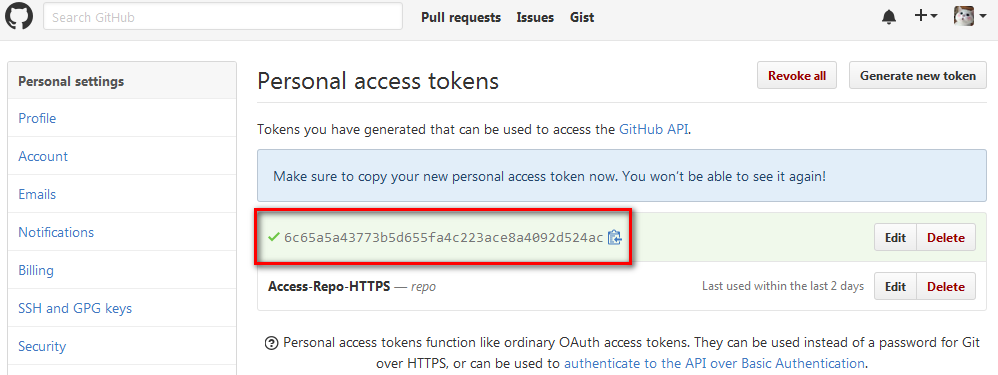

# Syncing

[](https://marketplace.visualstudio.com/items?itemName=nonoroazoro.syncing)
[](https://marketplace.visualstudio.com/items?itemName=nonoroazoro.syncing)
[](https://marketplace.visualstudio.com/items?itemName=nonoroazoro.syncing)

*Syncing* is designed to **sync all of your VSCode settings** with GitHub Gist.

> *Keep it simple & reliable*.


## Features

In order to **keep it as simple as possible**, there will be only two features:

1. **Upload**:

    * upload `settings, locale, snippets, keybindings, extensions`.
    * auto separate `Mac` and `non-Mac`'s `settings` and `keybindings` in case you have multiple devices.
    * auto create new Gist if it doesn't exist in remote.
    * auto remove remote files if they've been removed in local.
    * auto exclude unmodified settings to speed up the synchronization.

1. **Download**:

    * **always overwrite** local settings.
    * auto `install, update, remove` extensions (including the extensions version).
    * auto remove local files if they've been removed in remote.
    * you can download settings from a public Gist by leaving the `GitHub Personal Access Token` blank (but you still have to fill in your own token before uploading).


## Extension Commands

There're **`3 commands`** in this extension:

* Type `upload/download` (or `syncing`) in `VSCode Command Palette` to:

    * ***`Syncing: Upload Settings`***
    * ***`Syncing: Download Settings`***

* Also, you can set your `GitHub Personal Access Token` and `Gist ID` at anytime by:

    * ***`Syncing: Open Syncing Settings`***


## Extension Keybindings

The keybindings **are disabled by default**, you can enable them by updating `VSCode Keyboard Shortcuts`:

1. for VSCode versions >= 1.11 (***recommended***):

    


1. for VSCode versions < 1.11, for example:

    ```json
    {
        "key": "alt+cmd+u",
        "command": "syncing.uploadSettings"
    },
    {
        "key": "alt+cmd+d",
        "command": "syncing.downloadSettings"
    },
    {
        "key": "alt+cmd+s",
        "command": "syncing.openSettings"
    }
    ```


## Extension Proxy Settings

You can add a proxy to accelerate the synchronization, find and set the `"http.proxy"` property in `VSCode User Settings`, for example:

```json
"http.proxy": "http://127.0.0.1:1080"
```


## Get Your Own GitHub Personal Access Token and Gist ID

1. **Login to your `Settings` page.**

    

1. **Select `Personal access tokens` tab and click `Generate new token`.**

    

1. **Select `gist` and click `Generate token`.**

    

1. **Copy/backup your token.**

    

1. **After uploading, you can find the `VSCode Settings` and the corresponding `Gist ID` in your GitHub Gist.**

    
