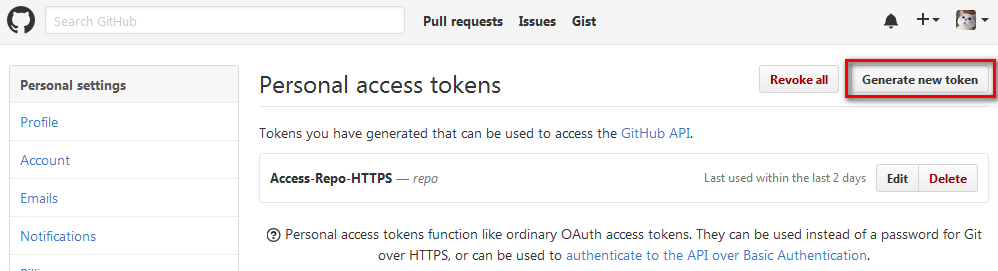
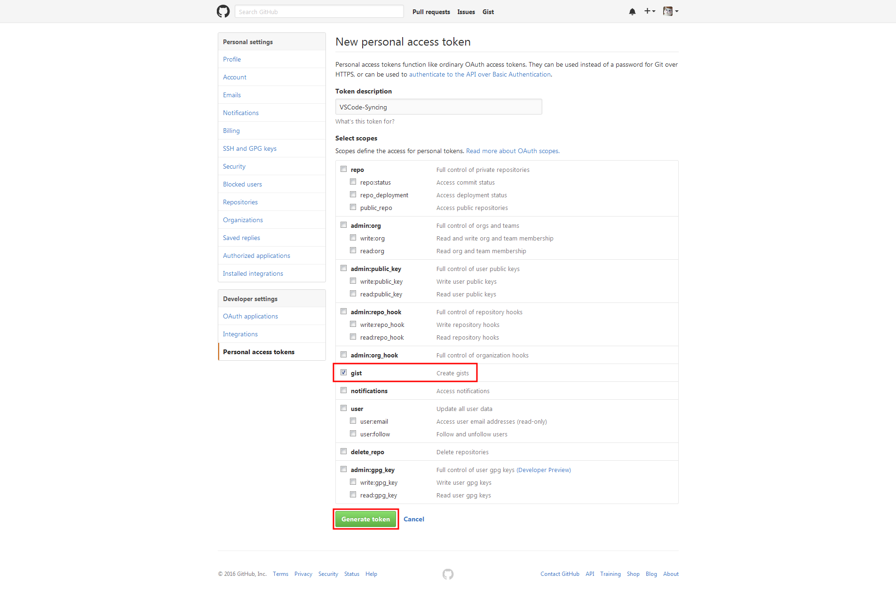
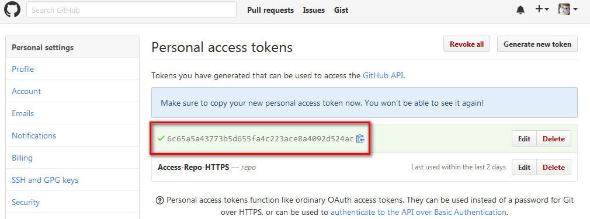

# Syncing

[](https://marketplace.visualstudio.com/items?itemName=nonoroazoro.syncing)
[](https://marketplace.visualstudio.com/items?itemName=nonoroazoro.syncing)
[](https://vsmarketplacebadge.apphb.com/rating/nonoroazoro.syncing.svg)

**Syncing** is a VSCode extension, proposed to sync **all of the VSCode's settings** to GitHub Gist.

> To keep the synchronization **simple & reliable**.


## Features

In order to keep this extension **as simple as possible**, there will be no other features, **only these 2:**

1. **Upload** VSCode settings to Gist:

    * **upload** `settings`, `locale`, `snippets`, `keybindings`, `extensions`.
    * **auto separate Mac and non-Mac**'s `settings` and `keybindings` (in case you have multiple devices).
    * auto create new Gist if it is not found in remote.
    * auto remove remote files when they're removed in local.
    * auto exclude unchanged settings (to speed up the synchronization).

1. **Download** VSCode settings from Gist.

    * **always overwrite** local settings.
    * auto `install`, `update`, `remove` extensions.
    * auto remove local files when they're removed in remote.
    * you can leave out the `GitHub Personal Access Token` blank to `download settings from a public Gist` (and don't forget to add your own GitHub token before uploading your settings :grimacing:).


## Extension Commands

There're **`3 commands`** in this extension.

Type `syncing` (or just `upload/download`) in VSCode Command Palette to:

* **`Syncing: Upload Settings`**
* **`Syncing: Download Settings`**

Also, you can change your `GitHub Token` or `Gist ID` by:

* **`Syncing: Open Syncing Settings`**


## Extension Keybindings

The keybindings are **not set by default**, but you can enable them by updating VSCode's `Keyboard Shortcuts`:

1. for VSCode versions >= 1.11 (*recommended*):

    

1. for VSCode versions < 1.11, for example:

    ```javascript
        {
            "key": "alt+cmd+u",
            "command": "syncing.uploadSettings"
        },
        {
            "key": "alt+cmd+d",
            "command": "syncing.downloadSettings"
        },
        {
            "key": "alt+cmd+s",
            "command": "syncing.openSettings"
        }
    ```


## Extension Proxy Settings

You can add a proxy to accelerate the synchronization, find and set the `"http.proxy"` property in VSCode `User Settings` like:

```javascript
    // HTTP
    // The proxy setting to use. If not set will be taken from the http_proxy and https_proxy environment variables
    "http.proxy": "http://127.0.0.1:1080"
```


## Get Your Own GitHub Personal Access Token and Gist ID

1. **Login to your `Settings` page.**

    

1. **Select `Personal access tokens` tab and click `Generate new token`.**

    

1. **Allow gist.**

    

1. **Copy/backup your token.**

    

1. **After uploading, you can find the `settings` and the corresponding `Gist ID` in your GitHub Gist.**

    
