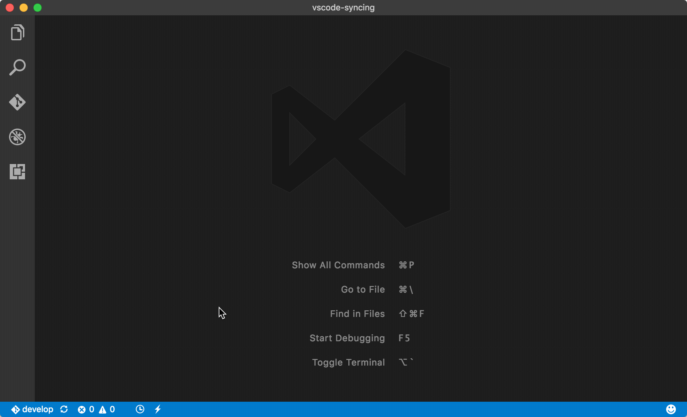
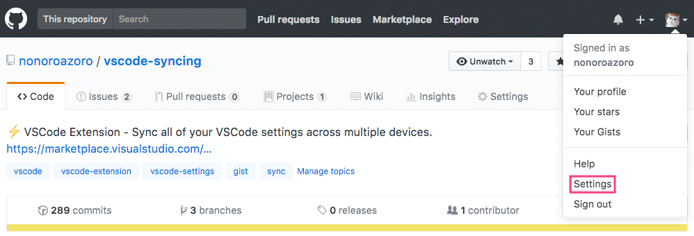
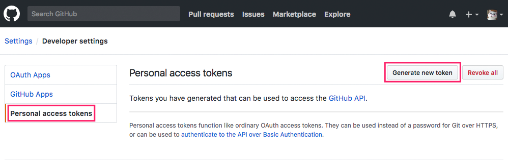
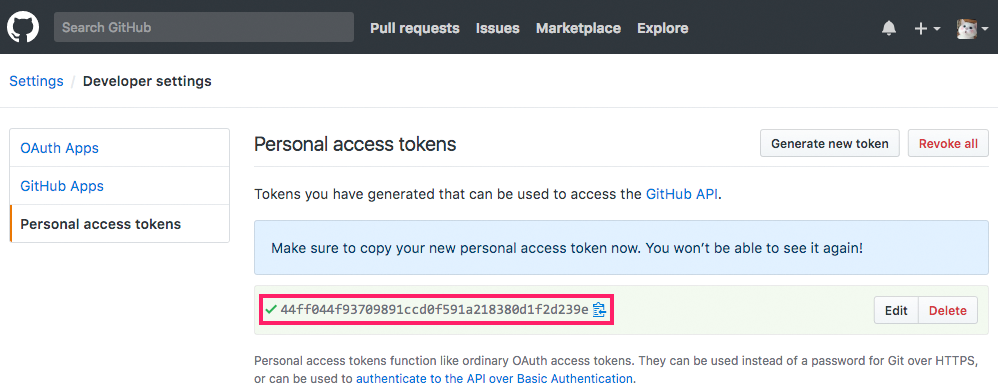
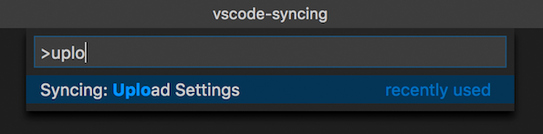
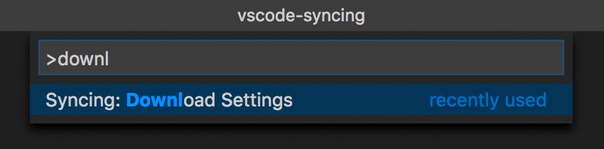
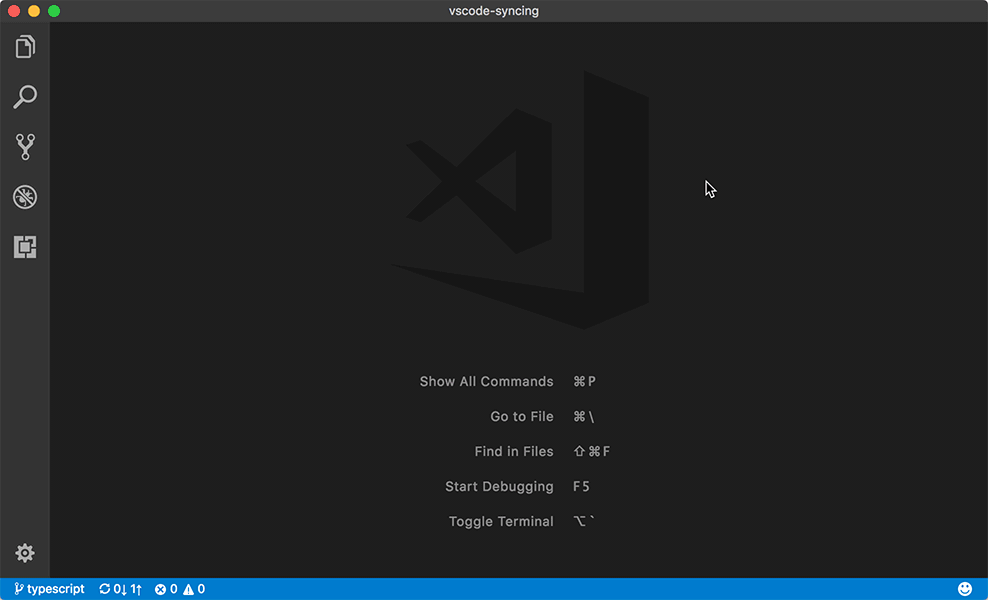

# Syncing

[](https://marketplace.visualstudio.com/items?itemName=nonoroazoro.syncing)
[](https://marketplace.visualstudio.com/items?itemName=nonoroazoro.syncing)
[](https://marketplace.visualstudio.com/items?itemName=nonoroazoro.syncing)

*Syncing ([View Source Code](https://github.com/nonoroazoro/vscode-syncing))* is a VSCode extension, designed to **sync all of your VSCode settings across multiple devices** with GitHub Gist. [Getting started!](#getting-started) or [check out the example](#example).

> *Keep it simple & reliable*.


## Features

*Syncing* will `keep the consistency of your VSCode settings between local and remote`, and let you:

1. **Upload Settings**:

    * Include `settings, keybindings, extensions, locales` and `snippets`.
    * The `settings` and `keybindings` of `Macintosh` and `non-Macintosh` will be synced separately, in case you have multiple devices.
    * Automatically create new Gist if you leave it blank or it doesn't exist in your GitHub Gist.
    * Use an incremental algorithm to boost the synchronization.

1. **Download Settings**:

    * **Always overwrite** local settings.
    * Automatically `install, update` and `remove` extensions.
    * You can leave the `GitHub Personal Access Token` blank to download from `a public Gist`.


## Commands

You can type `upload/download` (or `syncing`) in `VSCode Command Palette` to access the commands:

1. ***`Syncing: Upload Settings`***

    > Upload settings to GitHub Gist.

1. ***`Syncing: Download Settings`***

    > Download settings from GitHub Gist.

1. ***`Syncing: Open Syncing Settings`***

    > Set `GitHub Personal Access Token` and `Gist ID`.


## Keybindings

The keybindings **are disabled by default**, you can enable them by updating `VSCode Keyboard Shortcuts`:

1. for VSCode versions >= 1.11 (***recommended***):

    


1. for VSCode versions < 1.11, for example:

    ```json
    {
        "key": "alt+cmd+u",
        "command": "syncing.uploadSettings"
    },
    {
        "key": "alt+cmd+d",
        "command": "syncing.downloadSettings"
    },
    {
        "key": "alt+cmd+s",
        "command": "syncing.openSettings"
    }
    ```


## Proxy Settings

You can use a proxy to accelerate the synchronization, find and set the `"http.proxy"` property in `VSCode User Settings`. For example:

```json
"http.proxy": "http://127.0.0.1:1080"
```


## Getting Started

1. Get your own `GitHub Personal Access Token`

    1. **Login to your `GitHub Settings` page.**

        

    1. **From the list on the left, select `Personal access tokens` and click `Generate new token`.**

        

    1. **Select `gist` and click `Generate token`.**

        

    1. **Copy and backup your token.**

        

1. Sync your VSCode settings

    *`Syncing`* will ask for necessary information `for the first time` and `save for later use`.

    1. **Upload Settings**

        1. Type `upload` in `VSCode Command Palette`.

            

        1. Enter your `GitHub Personal Access Token`.

        1. Select or enter your `Gist ID` (or `leave it blank` to create automatically).

        1. Done!

        1. *After uploading, you can find the settings and the corresponding `Gist ID` in your [GitHub Gist](https://gist.github.com).*

    1. **Download Settings**

        1. Type `download` in `VSCode Command Palette`.

            

        1. Enter your `GitHub Personal Access Token` (or `leave it blank` if you want to download from a `public Gist`).

        1. Select or enter your own `Gist ID` (or a `public Gist ID`).

        1. Done!


## Example


