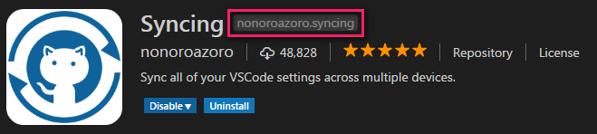

# Syncing

[](https://marketplace.visualstudio.com/items?itemName=nonoroazoro.syncing)
[](https://marketplace.visualstudio.com/items?itemName=nonoroazoro.syncing)
[](https://marketplace.visualstudio.com/items?itemName=nonoroazoro.syncing#review-details)

[English](README.md) | [中文](README.zh-CN.md)

**Syncing** *([源码](https://github.com/nonoroazoro/vscode-syncing))* 是一个 VSCode 扩展，它能在**多台设备之间同步您的所有 VSCode 配置**（借助了 [GitHub Gist](https://gist.github.com)）。

[点击这里](#快速开始)快速开始配置吧，当然您也可以先看看[示例](#示例)哦。

> *我的目标是始终让它保持**简单可靠**，所以提需求别太过分啊 :)*


## 重要变更

* 从 ***2.1.2*** 版本开始：

    1. 显著加快 VSCode 插件的下载和安装速度；

    1. 增加对各种 VSCode 版本的支持，包括：

        1. [VSCode 标准版本](https://code.visualstudio.com/)；

        1. [VSCode Insiders 版本](https://code.visualstudio.com/insiders/)；

        1. [VSCode Exploration 版本](https://github.com/Microsoft/vscode/issues/61787)；

        1. [VSCodium](https://github.com/VSCodium/vscodium)，这是 [FLOSS License](https://www.gnu.org/philosophy/floss-and-foss.en.html) 下的一个 VSCode 版本；

        1. 按照[默认配置](https://github.com/Microsoft/vscode/blob/master/product.json)自行编译的 VSCode 版本 (感谢 [@Backfighter](https://github.com/Backfighter) 的 PR)。

        > 无须担心，升级之后 Syncing 会自动帮您检测 VSCode 版本。


## 功能

*Syncing* 可以在`本地和云端之间同步您的所有 VSCode 配置`，包括：

1. **上传 VSCode 配置**:

    * 包括您的`用户设置`，`快捷键`，`扩展`，`语言设置`以及所有`代码片段（Snippets）`；
    * 因为 `Mac` 和`非 Mac` 设备的配置通常会有一些差异，所以`快捷键`将会按照操作系统的不同分别上传；
    * 自动帮您创建新的 `Gist` 来保存 VSCode 配置，例如当您第一次使用这个扩展上传配置时；
    * 为了加快同步速度，整个同步过程都是`增量`的；
    * 您可以`排除某些 VSCode 配置项和扩展`，以防它们被上传，具体请参考[这里](#vscode-配置项)。

1. **下载 VSCode 配置**:

    * 请注意，下载配置时会**覆盖**您的本地配置（以云端为准，精确同步）；
    * 自动帮您`安装`、`升级`和`删除`扩展；
    * 您可以从一个`公开的 Gist` 中下载配置。例如，下载您朋友分享的配置，只要问他要一个 `Gist ID` 就行了，具体请参考[这里](#快速开始)；
    * 您可以`排除某些 VSCode 配置项和扩展`，以防它们被下载，具体请参考[这里](#vscode-配置项)。

另外，如果您访问 GitHub 有困难（万恶的墙），您可以[配置一个代理](#代理设置)来加速同步。当然，同步时的`进度条`肯定有的咯！


## 命令

在 `VSCode 的命令面板`中，您可以输入 `upload`、`download`（或者 `syncing`）来快速搜索和执行 `Syncing` 的所有命令。

1. ***`Syncing: Upload Settings`***

    > 上传配置到 GitHub Gist。

1. ***`Syncing: Download Settings`***

    > 从 GitHub Gist 下载配置。

1. ***`Syncing: Open Syncing Settings`***

    > 设置 `GitHub Personal Access Token`、`Gist ID` 或`代理`。


## 快捷键

**默认情况下所有的快捷键都是关闭的**，但是您可以很轻松的在 `VSCode 键盘快捷方式`中指定您想要的快捷键：

1. 如果您的 VSCode 版本`高于 1.11`（***这是可视化的配置，强烈推荐***）:

    

1. 如果您的 VSCode 版本`低于 1.11`，那就只能手动配置啦，参考一下：

    ```json
    {
        "key": "alt+cmd+u",
        "command": "syncing.uploadSettings"
    },
    {
        "key": "alt+cmd+d",
        "command": "syncing.downloadSettings"
    },
    {
        "key": "alt+cmd+s",
        "command": "syncing.openSettings"
    }
    ```


## VSCode 配置项

您可以在 `VSCode 用户设置`中找到以下 `Syncing` 配置项。

1. ***`syncing.excludedExtensions`***

    通过这个配置项，您可以`排除特定的 VSCode 扩展`，以防它们被同步。那些不在此列表中的 VSCode 扩展将不受影响，依然会正常同步。

    > 配置规则可以参考 [Glob Patterns](https://github.com/isaacs/minimatch)。

    举个栗子：

    ```json
    "syncing.excludedExtensions" : [
        "somepublisher.*",
        "nonoroazoro.syncing"
    ]
    ```

    要注意的是，这里被排除的`扩展名称`其实是`扩展的 ID`（可在 VSCode 的`扩展`页中找到），如下图所示：

    

    这样一来 `nonoroazoro.syncing`（也就是本扩展）以及所有属于 `somepublisher` 这个作者的扩展就不会再被同步啦。

1. ***`syncing.excludedSettings`***

    通过这个配置项，您可以`排除特定的 VSCode 配置项`，以防它们被同步。那些不在此列表中的 VSCode 配置项将不受影响，依然会正常同步。

    > 配置规则可以参考 [Glob Patterns](https://github.com/isaacs/minimatch)。

    举个栗子：

    ```json
    "syncing.excludedSettings" : [
        "editor.*",
        "workbench.colorTheme"
    ]
    ```

    这样一来您的 VSCode 主题（`workbench.colorTheme`）以及所有与编辑器（`editor`）相关的配置项就不会再被同步啦。

1. ***`syncing.extensions.autoUpdate`***

    通过这个配置项，可以让 `Syncing` 在同步时自动升级您的 VSCode 扩展。

    这个功能是`默认开启`的，当然您也可以在 `VSCode 用户设置` 中关掉它。

1. ***`syncing.pokaYokeThreshold`***

    通过配置这个阈值，每次同步配置时，`Syncing` 都会检查您的本地和云端配置间的差异量。如果超出这个阈值，就会显示一个确认对话框，以防错误的覆盖您的配置。

    这个配置项的默认值是 `10`。您可以将其设置为 `0` 来关闭这个功能（不再检查和显示确认对话框）。

    举个栗子：

    ```json
    "syncing.pokaYokeThreshold" : 10
    ```

1. ***`syncing.separateKeybindings`***

    通过这个配置项，可以决定是否让 `Syncing` 按照设备`操作系统`的不同来分开同步您的`快捷键`配置。

    鉴于 `VSCode` 从 `1.27` 版本开始提供了 [Platform Specific Keybindings](https://code.visualstudio.com/updates/v1_27#_platform-specific-keybindings) 功能，您现在可以关闭这个功能。注意：在关闭该功能之前，请务必确保您已经手动合并了现有的`快捷键`配置。

    这个功能是`默认开启`的。您可以在 `VSCode 用户设置` 中关掉它。


## 代理设置

如果您访问 GitHub 有困难，比如在国内有万恶的墙，您可以配置一个代理来加速同步，具体步骤如下：

1. 在 `VSCode 的命令面板`中输入 `Syncing: Open Syncing Settings`（或者 `opensync`）来打开 `Syncing` 自己的配置文件（即 `syncing.json` 文件）；

1. 修改 `http_proxy` 的值，例如：

    ```json
    "http_proxy": "http://127.0.0.1:1080"
    ```

大功告成！另外，如果您不想在这里配置代理，那么 `Syncing` 也会尝试从系统环境中读取 `http_proxy` 和 `https_proxy` 作为代理设置。

> 注意：不同于那些保存在 [VSCode 用户设置](#vscode-配置项)中的 `Syncing` 配置项，这个独立的配置文件并**不会被同步**，因为里面保存了您的私人信息。


## 快速开始

1. 创建您自己的 `GitHub Personal Access Token`（总共 3 步）：

    1. 登录到您的 **[GitHub Personal Access Tokens 页面](https://github.com/settings/tokens)**，点击 **`Generate new token`**；

        

    1. 指定一个 **`name`**，然后勾选 **`gist`**，最后点击 **`Generate token`**；

        

    1. 点击 **`Copy`** 并且 **`备份`** 您的 Token。

        

1. 同步您的 VSCode 配置：

    在第一次使用时，`Syncing` 会向您询问一些必要的信息并保存下来以供后续使用，主要就是前面申请的 `GitHub Personal Access Token` 啦。

    1. **上传配置**

        1. 在 `VSCode 的命令面板` 中输入 `upload`；

            

        1. 填写刚才申请的 `GitHub Personal Access Token`；

        1. 在下拉框中选择或者手动输入一个 `Gist ID`；

            > 您可以留空，那样的话 `Syncing` 会自动帮您创建一个新的 `Gist`。

        1. 完成！

        1. *在上传完成后，您可以在 [GitHub Gist](https://gist.github.com) 中找到对应的 `Gist` 和 `Gist ID`。当然您也可以通过 `Edit` 和 `make it public` 操作将您的配置共享给其他人。*

    1. **下载配置**

        1. 在 `VSCode 的命令面板` 中输入 `download`；

            

        1. 填写您的 `GitHub Personal Access Token`；

            > 您可以留空，那样的话就能从一个`公开的 Gist`（比如您朋友共享给您的 `Gist`）来下载配置了。

        1. 在下拉框中选择或者手动输入一个 `Gist ID`（当然这里也可以输入一个`公开的 Gist ID`）。

        1. 完成！


## 示例

1. 上传配置：

    

1. 下载配置：

    
